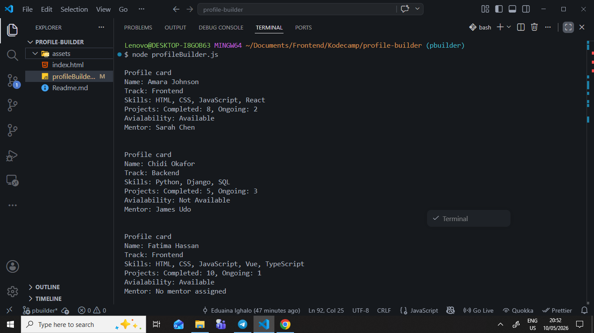
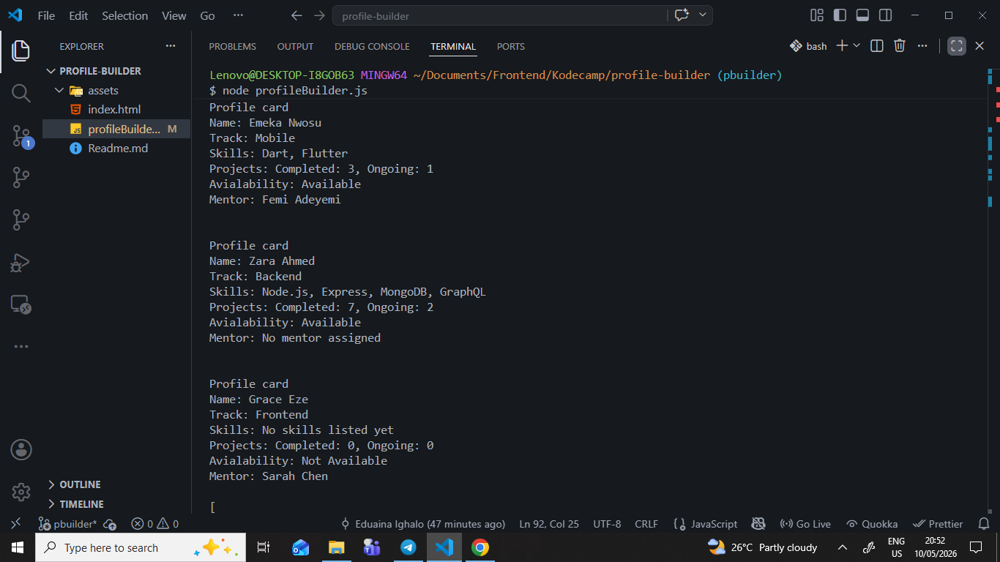
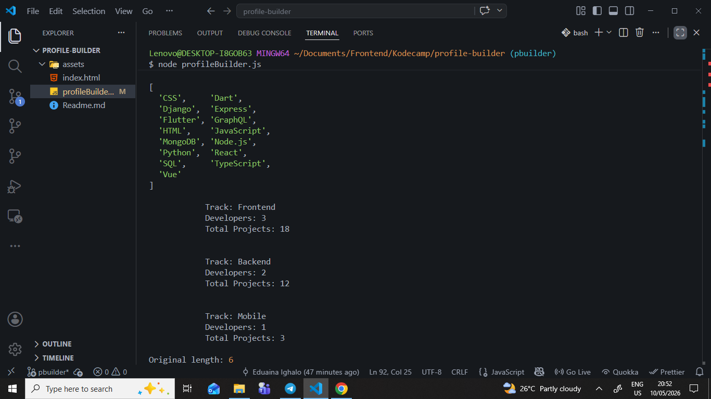
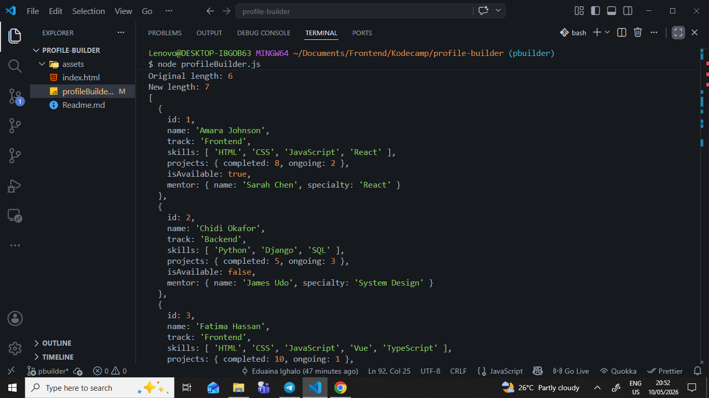
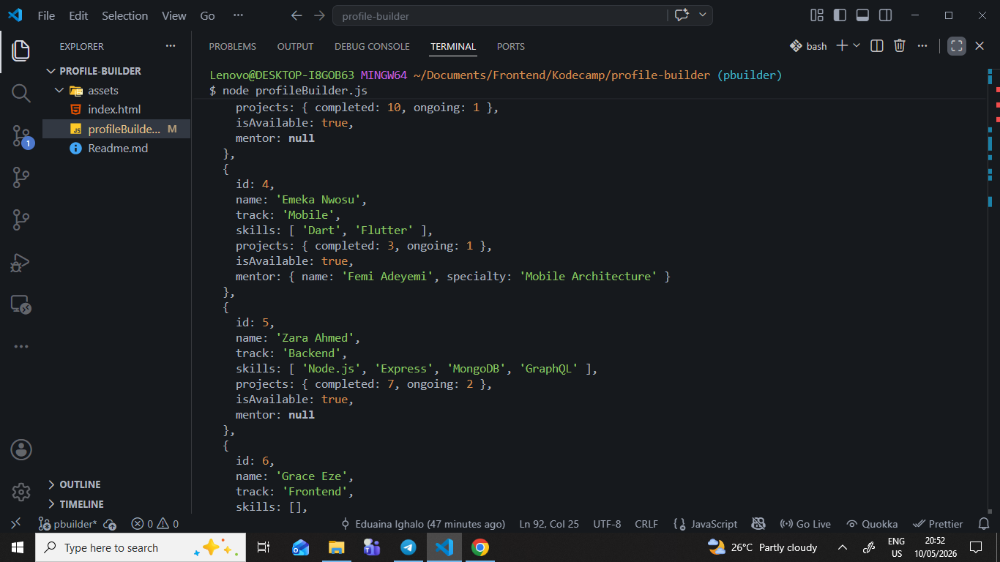
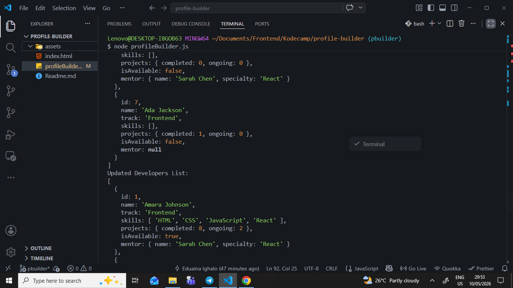
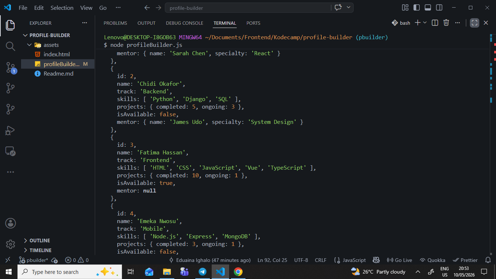
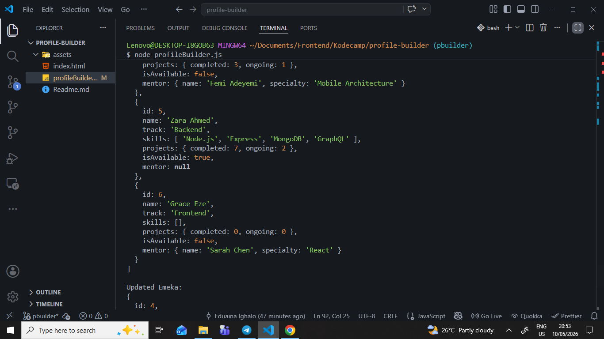

# Profile_Builder

Task by Eduaina Ighalo

Student ID: KC-STD-4154

React

Intermediate


## How to Run the File

1. Node.js should be installed on your PC.

2. Use an IDE to open the project folder.

3. Open the terminal.

4. Run the file using:

```bash
node profileBuilder.js
```

###  Screenshots








